# Hi there! 👋 I'm Shubham Kasture

<div align="center">
  
  
  
</div>

---

## 🚀 About Me

```typescript
const shubham = {
    location: "India 🇮🇳",
    education: "Final Year B.Tech Student 🎓",
    currentFocus: ["Full-Stack Development", "Android Apps", "AI Integration"],
    passion: "Building impactful software solutions",
    motto: "Turning ideas into working applications ✨"
};
```

- 🔭 Currently working on **NextGenHire** - AI-powered mock interview platform
- 🌱 Learning **Advanced Android Development** with Jetpack Compose
- 👯 Looking to collaborate on **Open Source Projects** and **AI applications**
- 💬 Ask me about **React, Node.js, Android, AI integration**
- ⚡ Fun fact: **I love bringing futuristic ideas to life through code!**

---

## 🛠️ Tech Stack & Tools

<div align="center">

### Languages


### Frontend


### Backend


### Databases


### Tools & Platforms


</div>

---

## 🌱 Currently Learning

```mermaid
graph TD
    A[🔧 Advanced Android Development] --> B[Jetpack Compose]
    A --> C[MVVM Architecture]
    A --> D[Firebase Integration]
    
    E[🧠 AI & ML Integration] --> F[OpenAI API]
    E --> G[TensorFlow]
    E --> H[Real-world Applications]
    
    I[🔗 Blockchain Development] --> J[Smart Contracts]
    I --> K[Web3 Integration]
    
    L[📱 Flutter Mastery] --> M[Bloc Pattern]
    L --> N[Provider State Management]
    L --> O[Advanced Animations]
```

<div align="center">



</div>

---

## 💼 Featured Projects

<div align="center">

### 🧠 NextGenHire – AI Mock Interview Platform
[](https://nextgenmock.vercel.app/)

**Tech Stack:** `React.js` `Node.js` `Neon DB` `Cleak OAuth` `Gemini API`

🎯 **Features:**
- AI-powered mock interviews with real-time feedback
- Anlysis 
- Performance tracking and analytics
- Interview scheduling and reminders

---

### 🍽️ MessMate – Android Mess Management App
[]([https://github.com/shubhamkasture7](https://github.com/GouriRajmane/B.Tech_Project))

**Tech Stack:** `Java` `Firebase` `Razorpay` `Android SDK`

🎯 **Features:**
- Join/create mess communities
- Real-time chat with mess members
- Payment integration for mess fees
- Menu management and notifications

---

### 🤖 JARVIS – AI Virtual Assistant
[]([https://github.com/shubhamkasture7](https://shubhamkasture7.github.io/jarvis/))

**Tech Stack:** `HTML` `CSS` `Java Script` `Speech Recognition`

🎯 **Features:**
- Voice command recognition
- Task automation and reminders
- Smart query answering
- Desktop integration

</div>

---

## 📊 GitHub Stats

<div align="center">


</div>

<div align="center">


</div>

---

## 🏆 Achievements & Certifications

<div align="center">


</div>

🎓 **Certifications:**
- Full Stack Web Development
- RAG (IBM Skillbuild)
- Android App Development
- AI/ML Fundamentals
- Cloud Computing (Azure)

🏅 **Achievements:**
- Built 15+ projects across different domains
- Integrated AI in multiple real-world applications
- Active contributor to open source projects
- Mentored 10+ students in programming

---

## 🤝 Let's Connect!

<div align="center">

[](https://linkedin.com/in/shubhamkasture)
[](mailto:shubhamkasture289@gmail.com)
[]()
[](https://twitter.com/shubhamkasture)

</div>

---

## 💡 Random Dev Quote

<div align="center">


</div>

---


<div align="center">

### 🚀 "Code is like humor. When you have to explain it, it's bad." - Cory House

**Thanks for visiting my profile! Feel free to explore my repositories and don't forget to ⭐ if you find something interesting!**

</div>

---

<div align="center">
  
</div>
